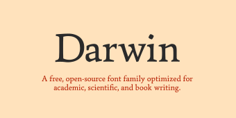
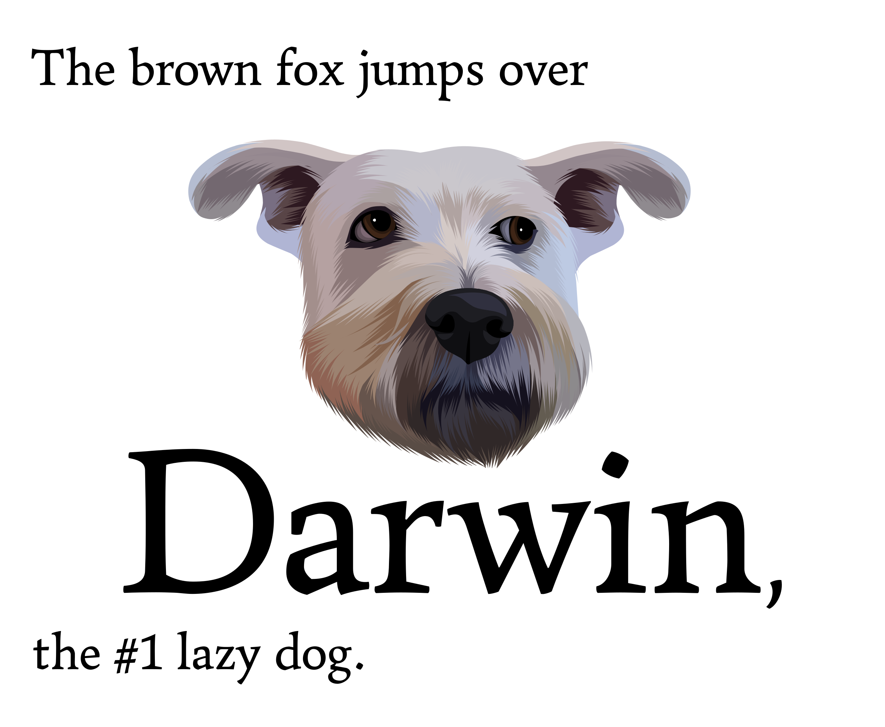

# The Darwin Typeface Project
<p align="left"></p>

This is the project repository for _Darwin_, a typeface for books and articles, with a focus on scientific writing.

## Overview
* Darwin is a free and open-source typeface project aiming to cover a wide range of languages and specialist (including medievalist and linguistic) usage, coming in several optical sizes and with an accompanying math font.
* The current state of progress on Darwin and planned future work are described in the sections [Plan of Development](#plan-of-development) and [Progress](#progress).
* Updates and progress reports are available via the [Updates section of the Darwin website](https://darwintypeface.com/updates.html), the [Darwin newsletter on Substack](https://emilydeoliveirasantos.substack.com/?r=1urmqa&utm_campaign=pub-share-checklist), or the [Discord server for Darwin](https://discord.gg/j73mpRgmgd).
* If you'd like to support this project, there are several ways to do so; see [Support](#support).

## Goals
Darwin is a typeface project aiming to fulfill the following goals:
1. It must be completely free and open-source.
2. It must have truly exceptional glyph coverage, covering a wide array of distinct usage cases:
   1. It must cover all languages using the Latin script listed in [Hyperglot](https://hyperglot.rosettatype.com/).

      This will be done by following the work of Christoph Koeberlin, who established a set of comprehensive [Latin Character Sets](https://christoph.koe.berlin/articles/en/more_latin/) covering all languages in [Hyperglot](https://hyperglot.rosettatype.com/) using the Latin script. A leading example of a font having this coverage is Christoph's [Pangea](https://fontwerk.com/en/fonts/pangea-superfamily).
   2. Similarly, it must also cover all languages using the Cyrillic script listed in [Hyperglot](https://hyperglot.rosettatype.com/), including historical usage.
   3. It must cover Greek, including advanced, historical, and specialised usage such as [polytonic Greek](https://en.wikipedia.org/wiki/Greek_diacritics), [Pontic Greek](https://en.wikipedia.org/wiki/Pontic_Greek#Alphabets), etc.
   4. (†) Extending the coverage of Darwin to even more languages using different scripts _eventually_ is also [under consideration](https://github.com/topological-modular-forms/Darwin-Typeface/issues/1).
   5. In addition to language support, Darwin must also provide extensive support for usage in linguistics, supporting the [IPA](https://en.wikipedia.org/wiki/International_Phonetic_Alphabet), [americanist phonetic notation](https://en.wikipedia.org/wiki/Americanist_phonetic_notation), the [extIPA](https://en.wikipedia.org/wiki/Extensions_to_the_International_Phonetic_Alphabet), etc.
   6. Finally, Darwin should support medievalist usage as defined by the [Medieval Unicode Font Initiative](https://mufi.info/).
3. It must come with a great number of optical sizes, from the smallest footnotes (~5pt), through headlines (~24pt), all the way up to book covers (~72pt).
4. It must come with a high-quality and extensive family of math fonts of matching style and an accompanying LaTeX package.

## Plan of Development
My work on Darwin will never end as long as I am able to work: there will always be extensions to other languages, additions of specialised glyphs, or polishing to do.

That said, here's the current plan of development and work for Darwin:
1. Finish polishing basic Latin in the Regular style.
2. Design Italic, Bold, Small Caps, and Bold Italic for basic Latin.
3. Design optical sizes for basic Latin in the above styles.
4. Design parts of the math font for Darwin.
5. Repeat the process outlined in Steps 1–3 for increasingly large amounts of characters, e.g.\ "Extended Latin" > "Extended Latin + Greek" > "Extended Latin + Greek + basic Cyrillic" > "Extended Latin + Greek + Extended Cyrillic" > etc.
6. Design more parts of the math font for Darwin once things like Greek/Cyrillic have been covered in Step 6 above.

(†) I also plan to design a Sans Serif version of Darwin, although I'm not sure yet what would be the best timing for this. It might be anywhere between Steps 1 and 2 to after everything is done.

Apart from the above, there are other things that can be done, but which aren't set in stone yet, such as:
- Experimenting with a variable width axis designed specifically for allowing a greater amount of expansion with [microtype](https://ctan.org/pkg/microtype); see [TeX SE 634421](https://tex.stackexchange.com/q/634421).
- Designing extra families as required by math usage, such as Monospace for basic Latin.
- Extending the font with other scripts as described in [Issue #01](https://github.com/topological-modular-forms/Darwin-Typeface/issues/1).

## Progress
Here's where the development of Darwin currently stands:
- [x] Regular style for basic Latin designed.
- [ ] Regular style for basic Latin polished.
- [ ] Basic Latin coverage extended to bold, italic, and bold italic.
- [ ] Basic Latin coverage extended to other optical sizes.
- [ ] Repeat the above steps for ever larger glyph sets.

Here “basic Latin” refers to the glyph set containing [A-Z][a-z][0-9], basic punctuation and alternate figures (old style, tabular, and tabular old style). A much wider glyph set has been designed for the Regular style of Darwin, which includes Greek, Cyrillic, extended Latin, etc., but work on extending the glyph set of the Regular style has been temporarily halted in favor of first polishing basic Latin and extending it to more styles, after which we'll go back to extending the glyph set for Darwin once more.

## Support
If you'd like to support the development of this project, there are several ways in which you can help:

1. You can share the project with people you know and who might be interested.

2. *If you are a physicist, mathematician, etc.:* If you have any suggestions or requests for font features, you can let me know about them by [opening an issue](https://github.com/topological-modular-forms/Darwin-Typeface/issues/new) or by [contacting me directly by email](mailto:emily.de.oliveira.santos.tmf@gmail.com).

   Examples of such features include e.g. `\mathbb` for lowercase, numbers, and Greek, special characters like ш for the Tate–Shafarevich group, variable size delimiters for doubled brackets `[[...]]`, etc.

   See also [MO 463883, _Suggestions and feature requests for the design of a font for math articles/books_](https://mathoverflow.net/questions/463883).

3. *If you are a linguist:* in a similar vein as Item 2 above, if you work in linguistics and have suggestions or requests for font features, you can again let me know about them by [opening an issue](https://github.com/topological-modular-forms/Darwin-Typeface/issues/new) or by [contacting me directly by email](mailto:emily.de.oliveira.santos.tmf@gmail.com).

   See also [Linguistics SE 48398, _What are difficulties linguists have run into with common fonts?_](https://linguistics.stackexchange.com/questions/48398).

4. If you'd like to directly support Darwin financially, you can do so through Ko-Fi or Patreon:

   <p align="center"><a href='https://ko-fi.com/A0A8PKR0E' target='_blank'></a>⠀⠀<a href="https://www.patreon.com/thedarwintypefaceproject" style="display:inline-block;"></a></p>
    
   I've been struggling financially for a while now, and my current source of income is unfortunately very unstable and fragile, so any donations would go a long way in helping ensure I'm able to continue working on Darwin.

## Build
I'm currently working on migrating to Glyphs, and plan to implement a build process for Darwin using [`fontmake`](https://github.com/googlefonts/fontmake). For now, see the [`output`](https://github.com/topological-modular-forms/Darwin-Typeface/tree/main/output) folder for OTF and TTF font files.

## Installation
Copying the output/ files in the relevant directories of your computer should be sufficient.

Alternatively, here are instructions for specific systems:
### Archlinux
Create the package and install it by running the following commands:
```
git clone https://github.com/topological-modular-forms/Darwin-Typeface/
cd Darwin-Typeface
makepkg
sudo pacman -U darwin-$(date +%Y%m%d)-1-$(uname -m).pkg.tar.zst
```

## Why “Darwin”?
The Darwin typeface is named after my dog, Darwin, who was in turn named so by my mother, after Charles Darwin:

<p align="center"></p>

You can find a photo of Darwin [here](https://darwintypeface.com/dogs/darwin/01.jpg) (extra photos: [[1]](https://darwintypeface.com/dogs/darwin/02.jpg), [[2]](https://darwintypeface.com/dogs/darwin/03.jpg), [[3]](https://darwintypeface.com/dogs/darwin/04.jpg), [[4]](https://darwintypeface.com/dogs/darwin/05.jpg), [[5]](https://darwintypeface.com/dogs/darwin/06.jpg)). Besides Darwin, I also had [Ed](https://darwintypeface.com/dogs/ed/01.jpg) (extra photos: [[1]](https://darwintypeface.com/dogs/ed/02.jpg), [[2]](https://darwintypeface.com/dogs/ed/03.jpg)), and currently have two other dogs, [Lola](https://darwintypeface.com/dogs/lola/01.jpg) (extra photos: [[1]](https://darwintypeface.com/dogs/lola/02.jpg), [[2]](https://darwintypeface.com/dogs/lola/03.jpg), [[3]](https://darwintypeface.com/dogs/lola/04.jpg)) and [Pequi](https://darwintypeface.com/dogs/pequi/01.jpg) (extra photos: [[1]](https://darwintypeface.com/dogs/pequi/02.jpg), [[2]](https://darwintypeface.com/dogs/pequi/03.jpg), [[3]](https://darwintypeface.com/dogs/pequi/04.jpg)).

## Supporters
This project is currently supported by the following people:
- Esther H.
- Eli Heuer
- Isaac Elenbaas

Their support is helping ensure I'm able to continue working on Darwin, and I'm immensely grateful for it!

## Acknowledgements
The following people have contributed to this project:

### Special Thanks
[Siriris](https://ko-fi.com/siriris) has been a long-time contributor to Darwin ever since I first [asked for feedback for it on Reddit](https://www.reddit.com/r/typography/comments/ywjdxz/looking_for_feedback_on_a_font_im_working_on/) in late 2022. Since then, they have guided me through the development of Darwin with their extensive expertise in type design. Siriris has also consistently and tirelessly provided me with invaluable feedback on all aspects of each and every iteration of Darwin, and continues to do so to this day. They have also aided me immensely with all other aspects of the project. Thank you so much, Siriris, without your help, kindness, and patience, Darwin wouldn't be where it is today.

[Kumar Chitrang](https://in.linkedin.com/in/kumarchitrang) has been a long-time user of Darwin, as well as a dear friend. Seeing Darwin being used in his work has consistently kept and continues to keep me motivated to work on it and to always strive to polish and improve Darwin to the best of my ability. There were (and continue to be) several times during the development of Darwin where I was met with hardships in life, and Kumar has always cheered and encouraged me through these difficult times, always in the immensely kind way that is characteristic of him. Thank you so much, Kumar, your kindness and support mean the world to me.

### Feedback and Suggestions
Below are listed (in alphabetic order by surname) some people who have contributed to this project with feedback and suggestions, of which I'm truly grateful for:

- Robert Allgeyer
- Jim Belk
- J. van Dobben de Bruyn
- Claude Chaunier
- Max Chernoff
- Timothy Chow
- [Sir Cornflakes](https://linguistics.stackexchange.com/users/9781/sir-cornflakes)
- Yves de Cornulier
- Austin Hemmelgarn
- [Joseph Ginsberg](https://www.linkedin.com/in/joseph-ginsberg-1a9ba6216/)
- [the_guruji](https://astrodon.social/@the_guruji)
- Sam Hopkins
- [indicator](https://mathoverflow.net/users/521939/indicator)
- Janus Bahs Jacquet
- Igor Khavkine
- Justin Penner
- Iosif Pinelis
- Apoorv Potnis
- [brass tacks](https://linguistics.stackexchange.com/users/5581/brass-tacks)
- Loren Spice
- Mikael Sundqvist
- Brauer Suzuki
- Hal Motley
- N. Virgo
- [Aiden Vrenna](https://github.com/serif)
- Willie Wong
- Liang Ze Wong
